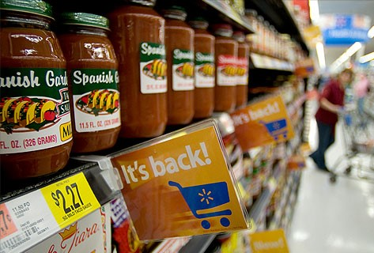

# M5 Forescasting - Accuracy

In this [Kaggle competition](https://www.kaggle.com/c/m5-forecasting-accuracy), we have been challenged to predict sales data provided by the retail giant Walmart 28 days into the future. The data, covers stores in three US States (California, Texas, and Wisconsin) and includes item level, department, product categories, and store details. In addition, it has explanatory variables such as price, promotions, day of the week, and special events. Together, this robust dataset can be used to improve forecasting accuracy.

# Contributors

* Frederick Corpuz <<fcorpuz@wesleyan.edu>>
* Wisly Juganda <<wjuganda@wesleyan.edu>>
* Kevin Koech <<kkoech@wesleyan.edu>>